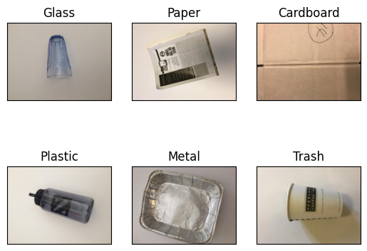

# MATH-318-Final-Project

Welcome to our Final Project for MATH 318 (Mathematical Applications of Statistical Software). For this project we focus on the classification of recyclable waste using two methods, Kmeans clustering with K-Nearest-Neighbors classification and Transfer Learning with [MobileNetV2](https://arxiv.org/abs/1801.04381). 

The motivation behind this project is to contribute to the need for automated systems to assist with identifying recyclable waste items. In our exploration, we leverage both traditional ML and Deep Learning techniques.

## The Dataset 

This project uses the [Garbage Classification Dataset](https://www.kaggle.com/datasets/asdasdasasdas/garbage-classification), which contains 2527 images of cardboard, glass, metal, plastic, and trash(non-recyclable waste). <br> 

**Examples**: 



## Project Structure

Our work documented and organized into three notebooks, also known as Challenges. These notebooks are conveniently located in the 'notebooks' directory. They provide a sequential layout of our experiments and results analysis, making it easy for you to follow along and understand our process.

In the 'src' directory, you will find our testing scripts, a zip of the Kaggle dataset, and our MobileNetV2 weights.  

## Requirements

Make sure you have Python 3.7+ & Jupyter installed on your system before you proceed. Click [here](https://jupyter.org/install) for a guide on installing Jupyter.

##### Note: we recommend setting up a new virtual environment before installing the required packages, if you're unfamiliar with setting up virtual environments, you can follow a this guide: https://docs.python.org/3/library/venv.html

After setting up your virtual environment, run the following to install the needed dependencies.

Linux/windows users:
```
pip install -r requirements.txt
```
MacOS users: 
```
pip install -r requirements-macos.txt
```

## Future Work

* Improving image histogramming procedure: Root cause of the accuracy issues with the kmeans & knn approach. 

* More complex architecture for transfer learning: accuracy of 79% leaves a lot to improve, empirical results show that our current architecture is not sufficient.

## Authors

**Luke Ingram** - *Co-Author* - [LukeIngram](https://github.com/LukeIngram) <br>
**Sahil Gill**  - *Co-Author* - [sg3596](https://github.com/sg3596)


## License

This project is licensed under the MIT License - see the [LICENSE](LICENSE) file for details.
